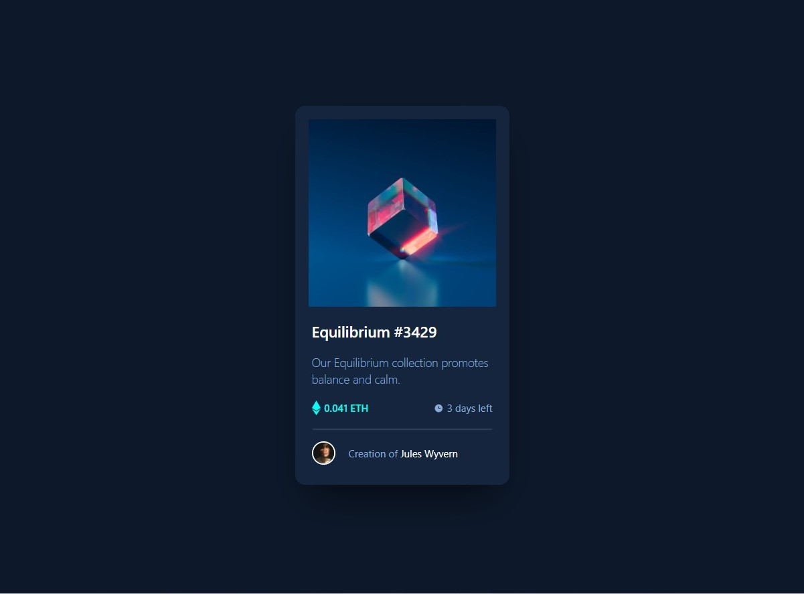

#  Frontend Mentor - NFT Preview Card Component Solution

This is a solution to the [NFT preview card component challenge on Frontend Mentor](https://www.frontendmentor.io/challenges/nft-preview-card-component-SbdUL_w0U). Frontend Mentor challenges help you improve your coding skills by building realistic projects.

## Table of contents

- [Overview](#overview)
  - [Screenshot](#screenshot)
  - [Links](#links)
- [Working on the project](#working-on-the-project)
  - [Prerequisists](#prerequisists)
  - [Installing the project](#installing-the-project)
- [My process](#my-process)
  - [Built with](#built-with)
  - [What I learned](#what-i-learned)
  - [Useful resources](#useful-resources)
- [Author](#author)

## Overview

### The challenge

Users should be able to:

- View the optimal layout depending on their device's screen size
- See hover states for interactive elements

### Screenshot

### Links

- [Solution URL](https://github.com/ecemgo/frontend-mentor-challenges/tree/main/nft-preview-card)
- [Live Site URL](https://ecemgo-nft-preview-card.netlify.app/)

## Working on the project

### Prerequisists

- Nodejs: v18.14.1 (LTS) (Install Nodejs)

### Installing the project

#### The node packages used:

- tailwindcss: v3.2.7

#### Install the node packages:

- Run command to install project dependencies respectively:
  - `cd nft-preview-card`
  - `npm install`

**Note:** You need to type the command like this since the `nft-preview-card` folder is a child of the `frontend-mentor-challenges` folder.

#### Run tests and watch for changes:

`npx tailwindcss -i ./src/styles.css -o ./public/styles.css --watch`

**Note:** Apart from the documentation of Tailwind CSS, a `public` directory was created instead of a `dist` directory, and `styles.css` was created instead of `input.css` and `output.css` in the project root; the files in the directory are ready for deployment.

## My process

### Built with

- Semantic HTML5 markup
- Tailwind CSS
- Flexbox

### What I learned

In this project, I focused on the following features of Tailwind CSS:

- How to make hover effect
- How to use transition duration
- Using shadows on colored backgrounds
- Using flexbox

### Useful resources

- [Tailwind CSS Documentation](https://tailwindcss.com/docs/installation) - It is used to understand the concept and apply the necessary features.
- [Hover effect on image](https://tailwind-elements.com/docs/standard/components/hover-effects/) - It is used how to make the hover effect on the image called equilibrium.

## Author

- Website - [ecemgo.com](https://www.ecemgo.com/)
- Frontend Mentor - [@ecemgo](https://www.frontendmentor.io/profile/ecemgo)
- Twitter - [@ecemgo](https://twitter.com/ecemgo)
- CodePen - [@ecemgo](https://codepen.io/ecemgo)
